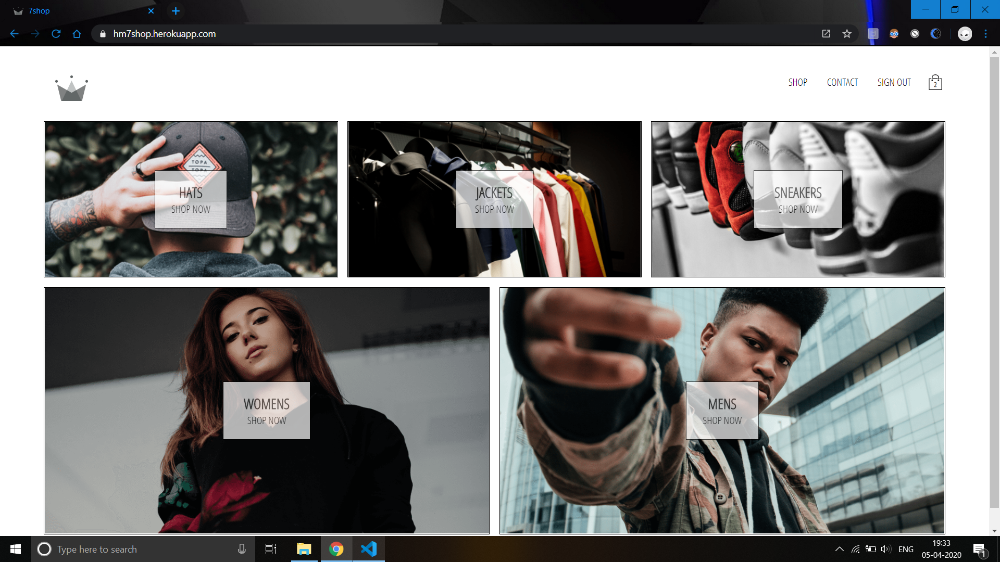
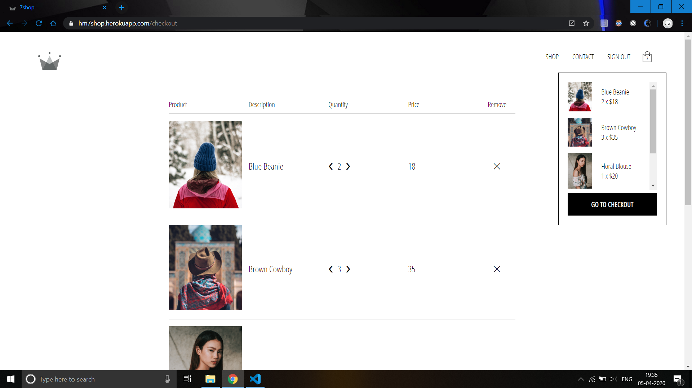
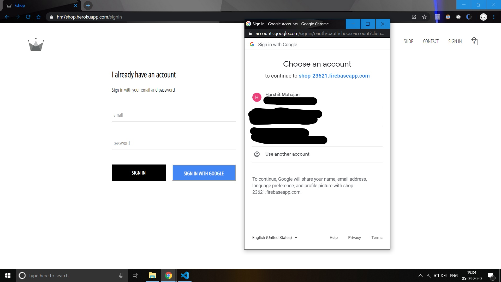

# 7Shop

> This is an e-commerce progressive web app made with React, Redux, Express, Firebase and Stripe API

> The frontend is build using React, Redux is used for state management.  
> Firebase is used for authentication(signing up,signing in,session persistence,signing out) and as a database for storing user and shop data.  
> Stripe API is used to handle payment requests from the backend server(built using Express framework). 

> Deployed at https://hm7shop.herokuapp.com

## This project uses the following libraries:
<ul>
<li><b>Redux-Saga </b></li>
<li><b>Hooks </b></li>
<li><b>React Router: </b>Client side routing</li>
<li><b>Reselect: </b>Caching/memoization purposes</li>
<li><b>Redux-persist: </b>Persisting state across sessions</li>
<li><b>Styled-components: </b>Styling purposes</li>
<li><b>Redux Thunk: </b>Used for handling asynchronous redux actions initially. Replaced with Sagas.</li>
</ul>

To run this project :
1. Clone this repo
2. Change your directory `cd client` and run `npm install` 
3. Move back to parent directory `cd ..` 
4. Run `npm install` again
5. Run `npm run dev`

#### Home Page :

#### Checkout Page :

#### SignIn Page :

#### PWA :
